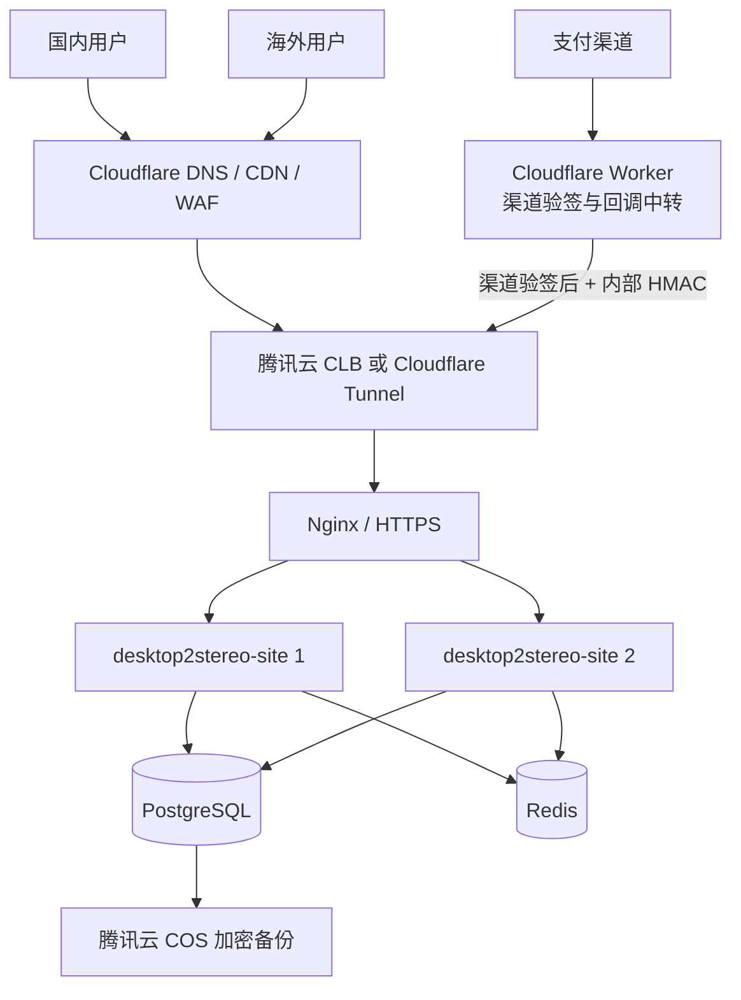

# d2s.site 服务端部署与运维方案

## 1. 文档定位

本文是 `desktop2stereo-site` 的唯一部署基准，合并原 `d2s.site` 网站架构方案与
Desktop2Stereo 授权服务部署要求。服务器端开发计划见
[`13-cross-platform-licensing-server-implementation-plan.md`](13-cross-platform-licensing-server-implementation-plan.md)。

生产原则是“腾讯云承载权威状态，Cloudflare 提供公网边缘防护和支付回调中转”：

- PostgreSQL 中的账号、订单、账务和授权记录是唯一权威状态。
- Redis 只用于会话、限流、缓存和多节点协调，不保存最终授权事实。
- Cloudflare 不保存 D1 授权状态，也不直接修改订单或授权。
- SQLite 仅用于本地开发；生产使用 PostgreSQL，MySQL 是受支持的替代方案。

## 2. 生产拓扑



首发可在一台腾讯云 CVM 上运行应用、Nginx、PostgreSQL 和 Redis，但数据库与 Redis
端口不得暴露公网。业务增长后，将数据库迁到托管实例，并通过 CLB 扩展到至少两个应用
容器。所有应用节点必须共享数据库、Redis、会话 Secret、授权签名私钥和支付桥 Secret。

## 3. 域名、网络与 TLS

- 正式域名：`d2s.site`，DNS 托管在 Cloudflare，并开启代理、WAF、DDoS 防护和限流。
- TLS：Cloudflare 使用“完全（严格）”，源站安装可信证书或 Cloudflare Origin Certificate。
- 源站：优先用 Cloudflare Tunnel 隐藏公网入口；如使用 CLB/CVM 公网 IP，仅开放 80/443，
  且 80 只跳转 HTTPS。
- 数据库 5432/3306 和 Redis 6379 只允许应用子网访问。
- `100393.com` 只作为预留灾备或管理域名；启用前必须具备独立访问控制，不能绕过 WAF。
- Nginx 只信任实际负载均衡/代理地址传入的客户端 IP；`TRUSTED_PROXIES` 不得配置为全网。

## 4. 支付回调链路

支付渠道回调地址指向 Cloudflare Worker。Worker 或源站渠道适配器必须先按渠道官方规则验证
签名、时间戳和重放条件，再把规范化事件转发到：

`POST https://d2s.site/api/v1/webhooks/{provider}`

转发请求使用与渠道 Secret 分离的 `D2S_PAYMENT_BRIDGE_SECRET` 生成
`X-D2S-Signature`。服务端再次校验订单、渠道、区域、金额和币种，并通过
`(provider, provider_event_id)` 幂等处理。Worker 不能直接写数据库，也不能仅依靠来源 IP
证明回调可信。建议再用 Cloudflare Access 服务令牌或 mTLS 限制桥接入口。

必须在渠道沙箱覆盖：成功、重复、乱序、延迟、取消、伪造、金额不符、币种不符和拒付。

## 5. 必需配置

基础配置：

- `SQL_DSN`：生产 PostgreSQL 或 MySQL 连接串。
- `REDIS_CONN_STRING`：生产 Redis 连接串。
- `SESSION_SECRET`：所有节点一致的高熵 Secret。
- `SESSION_COOKIE_SECURE=true`。
- `SESSION_COOKIE_TRUSTED_URL=https://d2s.site`。
- `TRUSTED_PROXIES`：实际 CLB、Nginx 或 Tunnel 网络范围。

授权与商业配置：

- `D2S_DEVICE_VERIFICATION_URI=https://d2s.site/device`。
- `D2S_LICENSE_KEY_ID`。
- `D2S_LICENSE_PRIVATE_KEY_B64`，内容为 P-256 PKCS#8 私钥的 Base64。
- `D2S_PAYMENT_BRIDGE_SECRET`。
- `D2S_OFFLINE_EXTENSION_CNY_MINOR`、`D2S_OFFLINE_EXTENSION_USD_MINOR`。

同时在 new-api 管理设置中启用邮箱验证、SMTP、Turnstile、支付合规确认和实际使用的支付
渠道。生产 Secret 只能进入腾讯云 Secret 管理、受限环境变量或编排系统 Secret，不能写入
仓库、镜像、数据库、日志和客户端。

## 6. 首次部署

1. 创建腾讯云 CVM/VPC、安全组、PostgreSQL、Redis 和 COS 备份桶。
2. 将 `d2s.site` 接入 Cloudflare，配置严格 TLS、WAF、限流和源站连接。
3. 克隆本仓库并从 `.env.example` 创建生产 Secret 配置。
4. 构建当前源码，不能直接使用未包含 D2S 扩展的上游镜像：

   ```bash
   docker compose build --pull
   docker compose up -d
   docker compose ps
   ```

5. 完成 new-api 初始化，启用邮箱验证、Turnstile 和支付渠道。
6. 部署支付回调 Worker，配置渠道原生 Secret 和独立桥接 Secret。
7. 执行健康检查：

   ```bash
   curl -fsS https://d2s.site/api/status
   curl -fsS https://d2s.site/api/v1/license/keys
   ```

8. 用测试账号完成注册、邮箱验证、试用创建、设备码登录、绑定、离线签发、在线租约和沙箱
   支付闭环后，才允许开放公网购买。

首次启动通过 GORM 建表。每次升级前必须做数据库快照，在同版本影子库连续执行两次迁移并
运行最小业务回归，再滚动生产节点。禁止多个不兼容版本同时执行结构变更。

## 7. 发布与回滚

- 镜像标签同时包含版本号和 Git SHA；禁止生产使用浮动 `latest`。
- 先迁移影子库，再灰度一个应用节点，观察错误率、租约、回调和数据库指标。
- 数据库变更优先采用向前兼容的 expand/contract；应用回滚不能依赖立即回滚表结构。
- 回滚时保留支付事件和账务流水，不删除已接收回调；恢复后重新对账。
- 发布前保存上一版本镜像、配置版本和数据库快照，并记录操作人及时间。

## 8. 授权签名密钥轮换

1. 生成新的 P-256 PKCS#8 私钥和唯一 `key_id`。
2. 先将新公钥加入客户端“当前键 + 上一键”清单并发布客户端。
3. 更新服务端 Secret 和 `D2S_LICENSE_KEY_ID`，滚动重启。
4. 验证新签发凭证、旧凭证和篡改凭证。
5. 旧公钥至少保留到所有旧离线凭证过期，再将旧键标记为 retired。

私钥不得进入客户端。`d2s_signing_keys` 只保存公钥元数据；密钥读取或签名失败必须停止
离线凭证签发并告警，不能降级为无签名授权。

## 9. 监控、备份与灾难恢复

至少监控并告警：

- HTTP 5xx、P95/P99 延迟、登录和设备码失败率。
- 在线租约冲突、离线签发失败、签名键异常和时钟偏差。
- 回调签名失败、金额不符、重复事件不一致、订单过期、拒付和负余额。
- PostgreSQL 连接、慢查询、复制延迟、磁盘容量；Redis 内存和淘汰。
- CVM/容器 CPU、内存、磁盘、重启次数和证书有效期。

PostgreSQL 每日全量备份并保留至少 30 天，关键表启用时间点恢复；备份加密后复制到 COS
不同故障域。每季度执行恢复演练，恢复后核对用户、订单、支付事件、余额流水、授权事件和
签发记录数量及关联完整性。日志需要脱敏，不能记录访问/刷新令牌、设备原始标识、私钥、
支付密钥或完整支付资料。

## 10. 上线门禁

满足以下条件后才可标记生产可用：

- SQLite、MySQL、PostgreSQL 新建库与重复迁移测试通过。
- 全部 Go 测试、静态检查、镜像构建和敏感信息扫描通过。
- 至少一个 CN 和一个 INTL 支付渠道完成沙箱回调矩阵；未实现渠道从页面移除。
- 双实例并发激活、租约、幂等订单和回调测试通过。
- 密钥轮换、备份恢复、故障回滚和监控告警演练有记录。
- Windows、Linux、macOS 客户端与生产等价环境完成端到端授权验收。
