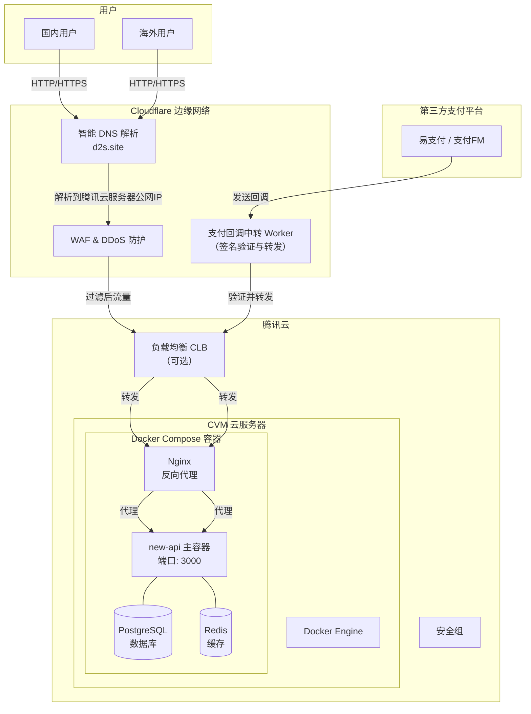

基于你的业务需求、现有资源以及 [`new-api`](https://github.com/QuantumNous/new-api) 项目的特点，我为你设计了一份完整的网站系统架构方案。

### 🏗️ 整体架构概览

整个系统遵循 **“国内核心部署、全球边缘加速”** 的原则，将核心业务（API网关、订单、数据库）部署在腾讯云，以确保稳定性和合规性；同时利用Cloudflare的全球网络来处理支付回调，保障关键业务链路的可靠性。

### 🔧 组件详解

#### 1. 腾讯云：核心业务承载平台

所有核心业务，包括 `new-api` 网关、数据库、订单处理和用户管理，都运行在腾讯云上。

*   **计算资源**：推荐使用一台或多台**腾讯云CVM（云服务器）**。根据 `new-api` 的官方建议，生产环境使用Docker Compose部署。
*   **数据持久化**：
    *   **数据库**：`new-api` 支持SQLite、MySQL和PostgreSQL。对于生产环境，**强烈建议使用PostgreSQL或MySQL**，并通过环境变量 `SQL_DSN` 进行配置。
    *   **缓存**：`new-api` 支持Redis。配置Redis（通过 `REDIS_CONN_STRING` 环境变量）可以显著提升多实例部署时的Session管理和限流效率。
*   **网络与安全**：
    *   **安全组**：为CVM配置安全组规则，**仅对必要的端口（如80、443）开放公网访问**。数据库（5432/3306）和Redis（6379）端口应**仅允许内网或指定IP访问**。
    *   **负载均衡（可选）**：若业务量较大，可在CVM前部署腾讯云**负载均衡（CLB）**，提升可用性。

#### 2. Cloudflare：全球边缘与支付回调安全网

Cloudflare在这里扮演双重角色：全球CDN/安全防护，以及支付回调的“稳定中转站”。

*   **DNS与流量管理**：
    *   将 `d2s.site` 的DNS解析托管在Cloudflare。
    *   利用Cloudflare的**智能DNS解析**功能，可以根据用户地理位置，将访问请求解析到最优的腾讯云节点IP。
    *   开启Cloudflare的**代理（小黄云）** 功能，可以为你的源站IP提供隐藏和保护。
*   **安全防护**：启用Cloudflare的**WAF（Web应用防火墙）** 和 **DDoS防护**，过滤恶意流量。
*   **支付回调中转（核心）**：
    *   创建一个**Cloudflare Worker**作为支付回调的“中间人”。
    *   **工作流程**：
        1.  在支付平台（如易支付/支付FM）的后台，将**回调地址（notifyUrl）** 配置为你的Worker地址。
        2.  支付平台将回调请求发送给Worker。
        3.  Worker执行**签名验证**，确保回调的真实性。
        4.  验证通过后，Worker将请求**转发**给腾讯云上的 `new-api` 服务（通过公网或内网通道）。
    *   **价值**：这个Worker层有效避免了支付回调请求在跨境网络中的丢包和延迟问题，确保了订单状态的准确同步。

#### 3. 域名与SSL证书

*   **正式域名 `d2s.site`**：
    *   作为面向用户的主域名，其DNS解析托管在Cloudflare。
    *   在Cloudflare上为此域名启用**SSL/TLS（推荐使用“完全（严格）”模式）**，提供端到端的HTTPS加密。
*   **备用域名 `100393.com`**：
    *   目前未使用，但建议将其也托管在Cloudflare。
    *   未来可以作为**内部管理后台**的专用域名，或作为 `d2s.site` 的备用、灾备域名，增加系统的灵活性。

### 🔄 关键数据流详解

#### 1. 用户访问流程（正常业务）
用户通过 `https://d2s.site` 访问网站。
1.  **DNS解析**：Cloudflare根据用户IP，将域名解析到腾讯云CVM的公网IP。
2.  **流量清洗**：请求经过Cloudflare的WAF和DDoS防护层。
3.  **反向代理**：请求到达腾讯云CVM，由Nginx反向代理接收。
4.  **业务处理**：Nginx将请求转发给 `new-api` 容器（监听3000端口）。
5.  **数据读写**：`new-api` 根据业务需求，读写PostgreSQL和Redis。

#### 2. 支付回调流程（关键业务）
用户完成支付后，支付平台（如易支付）发起回调。
1.  **回调发起**：支付平台向配置的 `notifyUrl`（即你的Worker地址）发送HTTP请求。
2.  **Worker验证**：Cloudflare Worker接收到请求，首先验证回调签名，确认其真实性。
3.  **安全转发**：验证通过后，Worker将请求转发至腾讯云 `new-api` 的公网入口（或通过内网通道）。
4.  **订单更新**：`new-api` 接收到回调，处理订单状态更新、用户额度充值等操作。
5.  **结果返回**：`new-api` 处理成功后，向Worker返回成功响应，Worker再原样回传给支付平台。

### 🛡️ 安全与高可用建议

*   **安全加固**：
    *   所有面向公网的服务**必须使用HTTPS**。
    *   在 `new-api` 后台配置**IP白名单**，仅允许可信IP（如你的Worker出口IP）访问支付回调接口。
    *   定期更新 `new-api` 镜像、操作系统和数据库密码。
*   **高可用设计**：
    *   **数据库**：启用PostgreSQL或MySQL的自动备份，并将备份文件存储至腾讯云COS（对象存储）。
    *   **容器**：在 `docker-compose.yml` 中为所有服务配置 `restart: always`，确保服务崩溃后能自动重启。
    *   **监控告警**：接入腾讯云监控，对CVM的CPU、内存、磁盘和网络进行监控，并设置告警策略。

### 📋 部署步骤概要

1.  **环境准备**：在腾讯云购买一台CVM，安装Docker和Docker Compose。
2.  **部署 `new-api`**：
    *   克隆项目 `git clone https://github.com/QuantumNous/new-api.git`。
    *   编辑 `docker-compose.yml`，配置PostgreSQL和Redis服务，并设置好 `SQL_DSN`、`REDIS_CONN_STRING` 等环境变量。
    *   运行 `docker-compose up -d` 启动服务。
3.  **配置反向代理**：在CVM上安装Nginx，配置反向代理将 `d2s.site` 的请求转发至 `localhost:3000`。
4.  **配置Cloudflare**：
    *   将 `d2s.site` 的DNS托管至Cloudflare，并开启代理。
    *   编写并部署支付回调中转Worker。
5.  **配置支付**：在 `new-api` 后台填写支付平台（如易支付/支付FM）的API地址、商户ID、密钥等信息，并将回调地址设置为你的Worker地址。

这套架构充分利用了腾讯云的稳定性和Cloudflare的全球网络，为你的业务提供了一个安全、可靠且具备扩展性的基础。