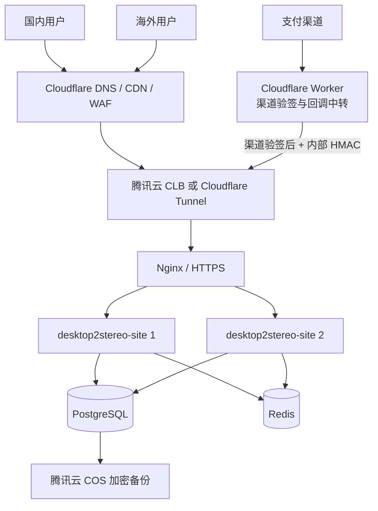

# 100393.com 服务端部署与运维方案

## 1. 文档定位

本文是 `desktop2stereo-site` 的唯一部署基准，合并原 `d2s.site` 网站架构方案与
Desktop2Stereo 授权服务部署要求。服务器端开发计划见
[`01-cross-platform-licensing-server-implementation-plan.md`](01-cross-platform-licensing-server-implementation-plan.md)。
上线前与季度恢复演练按 [`d2s-production-drill.md`](d2s-production-drill.md) 执行。

生产原则是“腾讯云承载权威状态，Cloudflare 提供公网边缘防护和支付回调中转”：

- PostgreSQL 中的账号、订单、账务和授权记录是唯一权威状态。
- Redis 只用于会话、限流、缓存和多节点协调，不保存最终授权事实。
- Cloudflare 不保存 D1 授权状态，也不直接修改订单或授权。
- SQLite 仅用于本地开发；生产使用 PostgreSQL，MySQL 是受支持的替代方案。
- SQLite 的 D2S 写事务对短暂的 `database is locked/deadlocked` 进行有限重试；这只提高本地开发并发稳定性，生产仍必须使用 PostgreSQL 或 MySQL。

无管理员权限的 Windows 开发机可使用仓库外的 `.local-db` 便携实例运行真实数据库矩阵：

```powershell
.\scripts\d2s-local-db-install.ps1 -Start
.\scripts\d2s-local-db.ps1 -Action init
$env:D2S_TEST_POSTGRES_DSN = 'host=127.0.0.1 port=5433 user=d2s_test password=<local-password> dbname=d2s_test sslmode=disable'
$env:D2S_TEST_MYSQL_DSN = 'd2s_test:<local-password>@tcp(127.0.0.1:3307)/d2s_test?charset=utf8mb4&parseTime=True&loc=Local'
go test ./model -run 'TestD2SSchemaConfiguredDatabases|TestD2SConcurrentCriticalPaths' -count=1 -v
.\scripts\d2s-local-db.ps1 -Action stop
```

首次使用先执行 `d2s-local-db-install.ps1 -Start`。脚本从 PostgreSQL 和 MySQL 官方 HTTPS
下载地址获取固定版本，安装到工作区外的 `.local-db`，初始化数据目录后可选启动两个实例；
已存在的压缩包、程序和数据目录会复用，不注册 Windows 系统服务。`.local-db`、下载缓存和
数据库文件不进入 Git。360 等安全软件应信任固定的 `.local-db` 目录以及下方列出的 Go 测试目录。

`init` 会幂等创建本地 `d2s_test` 数据库、测试用户和授权；默认测试密码为 `d2s_test`。
如需自定义密码，在当前 PowerShell 进程设置 `D2S_LOCAL_DB_TEST_PASSWORD`，MySQL root 和
PostgreSQL superuser 密码分别使用 `D2S_LOCAL_MYSQL_ROOT_PASSWORD` 与
`D2S_LOCAL_POSTGRES_PASSWORD` 注入，密码不会写入脚本或仓库。

该脚本只管理 `127.0.0.1:5433` 和 `127.0.0.1:3307` 的便携进程，不注册 Windows 系统服务；`.local-db/` 已加入忽略规则，不能用于生产部署。

如果 Windows 杀毒软件拦截 Go 测试程序，不要信任 Go 默认生成的动态 `%TEMP%\go-build*` 目录，改用固定路径测试脚本：

```powershell
.\scripts\d2s-fixed-go-test.ps1
```

建议将以下固定目录加入信任列表：

- `E:\AI_2D_to_3D\4.LC700X_Desktop2Stereo\.go-test-binaries`
- `E:\AI_2D_to_3D\4.LC700X_Desktop2Stereo\.go-build-cache-d2s`
- `E:\AI_2D_to_3D\4.LC700X_Desktop2Stereo\.go-tmp-d2s`

脚本默认验证 `controller`、`model`、`service` 和 `router`，并把最终测试可执行文件固定输出到 `.go-test-binaries`。

前端 Vitest 测试使用固定路径脚本，避免 Node/Vite 回落到系统临时目录：

```powershell
.\scripts\d2s-fixed-web-test.ps1 src/features/d2s/__tests__ src/routes/__tests__/device.test.tsx
```

脚本使用以下固定目录：

- `E:\AI_2D_to_3D\4.LC700X_Desktop2Stereo\.web-cache-d2s`
- `E:\AI_2D_to_3D\4.LC700X_Desktop2Stereo\.web-tmp-d2s`

Go 或前端工具在固定父目录内部生成的编译子目录仍可能带工具链生成的名称；360 应信任上述固定父目录，而不是只信任某一次生成的子目录或可执行文件。

## 2. 生产拓扑



首发可在一台腾讯云 CVM 上运行应用、Nginx、PostgreSQL 和 Redis，但数据库与 Redis
端口不得暴露公网。业务增长后，将数据库迁到托管实例，并通过 CLB 扩展到至少两个应用
容器。所有应用节点必须共享数据库、Redis、会话 Secret、授权签名私钥和支付桥 Secret。

## 3. 域名、网络与 TLS

- 正式域名：`100393.com`，DNS 托管在 Cloudflare，并开启代理、WAF、DDoS 防护和限流。
- TLS：Cloudflare 使用“完全（严格）”，源站安装可信证书或 Cloudflare Origin Certificate。
- 源站：优先用 Cloudflare Tunnel 隐藏公网入口；如使用 CLB/CVM 公网 IP，仅开放 80/443，
  且 80 只跳转 HTTPS。
- 数据库 5432/3306 和 Redis 6379 只允许应用子网访问。
- `www.100393.com` 作为正式域名别名时必须保持同等 TLS、WAF 和访问控制策略，不能绕过 WAF。
- Nginx 只信任实际负载均衡/代理地址传入的客户端 IP；`TRUSTED_PROXIES` 不得配置为全网。

## 4. 支付回调链路

支付渠道回调地址指向 Cloudflare Worker。Worker 或源站渠道适配器必须先按渠道官方规则验证
签名、时间戳和重放条件，再把规范化事件转发到：

`POST https://100393.com/api/v1/webhooks/{provider}`

转发请求使用与渠道 Secret 分离的 `D2S_PAYMENT_BRIDGE_SECRET[_PROVIDER]` 生成
`X-D2S-Signature`；例如 Stripe 使用 `D2S_PAYMENT_BRIDGE_SECRET_STRIPE`。服务端优先使用
渠道专用 Secret，未配置时才回退到全局 Secret，再次校验订单、渠道、区域、金额和币种，并通过
`(provider, provider_event_id)` 幂等处理。Worker 不能直接写数据库，也不能仅依靠来源 IP
证明回调可信。建议再用 Cloudflare Access 服务令牌或 mTLS 限制桥接入口。

当前 Go 服务也提供已验签渠道的直接适配入口：Stripe、Creem、易支付、Waffo 和 Waffo
Pancake 回调在本地完成官方验签后进入同一 D2S 事件处理器；这不改变通用桥接接口的用途。
PayPal/Paddle 在完成适配器前不开放。

必须在渠道沙箱覆盖：成功、重复、乱序、延迟、取消、伪造、金额不符、币种不符和拒付。

日终由管理员调用 `GET /api/v1/admin/reconciliation`（可传 UTC Unix `start_at`/`end_at`）
导出内部订单与支付事件报告，再与各渠道结算文件逐笔核对。报告中的过期待支付、孤立事件、
订单/事件金额或币种不一致必须在放量前处理；该接口不会自动修改订单或账本。

生产服务器使用固定路径的 systemd timer 每天 02:15 UTC 执行对账。安装仓库中的
`deploy/desktop2stereo-reconciliation.sh` 到 `/usr/local/sbin/desktop2stereo-reconciliation`，
并创建 root-only 的 `/etc/desktop2stereo/reconciliation.env`：

```text
D2S_RECONCILIATION_BASE_URL=https://100393.com
D2S_RECONCILIATION_ROOT=/opt/desktop2stereo-site
D2S_RECONCILIATION_REPORT_ROOT=/opt/desktop2stereo-site/reconciliation-reports
D2S_ADMIN_TOKEN=<admin-token>
```

环境文件必须使用 `root:root` 和 `0600` 权限，不能提交到 Git。再安装并启用：

```bash
install -o root -g root -m 0750 deploy/desktop2stereo-reconciliation.sh \
  /usr/local/sbin/desktop2stereo-reconciliation
install -d -o root -g root -m 0700 /etc/desktop2stereo
install -d -o root -g root -m 0700 /opt/desktop2stereo-site/reconciliation-reports
install -o root -g root -m 0644 deploy/desktop2stereo-reconciliation.service \
  /etc/systemd/system/desktop2stereo-reconciliation.service
install -o root -g root -m 0644 deploy/desktop2stereo-reconciliation.timer \
  /etc/systemd/system/desktop2stereo-reconciliation.timer
systemctl daemon-reload
systemctl enable --now desktop2stereo-reconciliation.timer
```

报告固定保存到 `/opt/desktop2stereo-site/reconciliation-reports/`，同一 UTC 日期的已有报告
不会被覆盖。存在差异时脚本以非零状态退出，`systemctl status`、journal 和服务器监控可据此
告警；脚本不会输出管理员令牌，也不会自动修改订单或账本。

## 5. 必需配置

基础配置：

- `SQL_DSN`：生产 PostgreSQL 或 MySQL 连接串。
- `REDIS_CONN_STRING`：生产 Redis 连接串。
- `SESSION_SECRET`：所有节点一致的高熵 Secret。
- `SESSION_COOKIE_SECURE=true`。
- `SESSION_COOKIE_TRUSTED_URL=https://100393.com`。
- `TRUSTED_PROXIES`：实际 CLB、Nginx 或 Tunnel 网络范围。

授权与商业配置：

- `D2S_DEVICE_VERIFICATION_URI=https://100393.com/device`。
- `D2S_LICENSE_KEY_ID`。
- `D2S_LICENSE_PRIVATE_KEY_B64`，内容为 P-256 PKCS#8 DER 私钥的 Base64；运行时也兼容
  Base64 编码的 PEM，以便平滑迁移既有部署。
- `D2S_PAYMENT_BRIDGE_SECRET`；推荐按渠道配置 `D2S_PAYMENT_BRIDGE_SECRET_STRIPE`、
  `D2S_PAYMENT_BRIDGE_SECRET_CREEM`、`D2S_PAYMENT_BRIDGE_SECRET_EPAY`、
  `D2S_PAYMENT_BRIDGE_SECRET_PAYMENTFM`、`D2S_PAYMENT_BRIDGE_SECRET_ALIPAY`、
  `D2S_PAYMENT_BRIDGE_SECRET_WECHAT`、`D2S_PAYMENT_BRIDGE_SECRET_WAFFO` 和
  `D2S_PAYMENT_BRIDGE_SECRET_WAFFO_PANCAKE`，渠道专用值优先于全局值。
- `D2S_OFFLINE_EXTENSION_CNY_MINOR`、`D2S_OFFLINE_EXTENSION_USD_MINOR`。

部署前运行 `scripts/d2s-production-readiness.ps1 -RequireSecrets` 时，脚本还会校验离线延长
价格为正整数、签名私钥配置为有效 Base64，并拒绝 `0.0.0.0/0`、`::/0`、`*` 或 `all` 这类
全网信任代理配置；`TRUSTED_PROXIES=none` 只能单独使用；会话 Secret 和支付桥 Secret
至少需要 32 个字符。`-BaseUrl` 必须是没有凭据、路径、查询串或片段的 HTTPS origin，
即使使用 `-SkipHttp` 也会执行此校验。

同时在 new-api 管理设置中启用邮箱验证、SMTP、支付合规确认和实际使用的支付渠道。
登录/注册使用服务端自托管点击验证码；邮箱验证码、密码重置和其他仍接入 Turnstile
的入口，只有在对应接口完成迁移并验证后才能关闭 Turnstile。生产 Secret 只能进入腾讯云
Secret 管理、受限环境变量或编排系统 Secret，不能写入仓库、镜像、数据库、日志和客户端。

## 6. 首次部署

1. 创建腾讯云 CVM/VPC、安全组、PostgreSQL、Redis 和 COS 备份桶。
2. 将 `100393.com` 接入 Cloudflare，配置严格 TLS、WAF、限流和源站连接。
3. 克隆本仓库并从 `.env.example` 创建生产 Secret 配置。
   至少设置 `POSTGRES_PASSWORD` 和 `REDIS_PASSWORD`；生产 Compose 不再提供数据库或 Redis
   密码默认值，执行 `docker compose config` 可提前检查变量是否齐全。
4. 先确认 Go 没有被旧的代理覆盖，并使用官方模块代理和校验服务；这不改变 `go.mod`，也不绕过模块校验：

   ```bash
   go env -u GOPROXY
   go env -u GOSUMDB
   go env GOPROXY GOSUMDB
   go mod download
   go mod verify
   ```

   也可以使用仓库内脚本执行上述检查；脚本只修改当前 PowerShell 进程的环境变量，不会污染全局 Go 配置：

   ```powershell
   .\scripts\d2s-go-deps.ps1
   ```

   只有部署机到官方服务的链路确实超时，才显式允许临时切换镜像；当前项目默认不使用镜像：

   ```powershell
   .\scripts\d2s-go-deps.ps1 -AllowMirrorFallback
   ```
5. 构建当前源码，不能直接使用未包含 D2S 扩展的上游镜像：

   ```bash
   docker compose build --pull
   docker compose up -d
   docker compose ps
   ```

6. 完成 new-api 初始化，启用邮箱验证和支付渠道；按接口实际使用情况配置仍需要 Turnstile
   的高风险入口，并验证登录/注册点击验证码可用。
7. 部署支付回调 Worker，配置渠道原生 Secret 和独立桥接 Secret；优先使用每渠道独立的
   `D2S_PAYMENT_BRIDGE_SECRET_{PROVIDER}`，仅在兼容旧部署时使用全局 Secret 回退。
8. 执行健康检查：

   ```bash
   curl -fsS https://100393.com/api/status
   curl -fsS https://100393.com/api/v1/license/keys
   ```

9. 用测试账号完成注册、邮箱验证、试用创建、设备码登录、绑定、离线签发、在线租约和沙箱
   支付闭环后，才允许开放公网购买。

首次启动通过 GORM 建表。每次升级前必须做数据库快照，在同版本影子库连续执行两次迁移并
运行最小业务回归，再滚动生产节点。禁止多个不兼容版本同时执行结构变更。

## 7. 发布与回滚

- 镜像标签同时包含版本号和 Git SHA；禁止生产使用浮动 `latest`。
- 先迁移影子库，再灰度一个应用节点，观察错误率、租约、回调和数据库指标。
- 数据库变更优先采用向前兼容的 expand/contract；应用回滚不能依赖立即回滚表结构。
- 回滚时保留支付事件和账务流水，不删除已接收回调；恢复后重新对账。
- 发布前保存上一版本镜像、配置版本和数据库快照，并记录操作人及时间。

## 8. 授权签名密钥轮换

1. 生成新的 P-256 PKCS#8 私钥和唯一 `key_id`。
2. 先将新公钥加入客户端“当前键 + 上一键”清单并发布客户端。
3. 更新服务端 Secret 和 `D2S_LICENSE_KEY_ID`，滚动重启。
4. 验证新签发凭证、旧凭证和篡改凭证。
5. 旧公钥至少保留到所有旧离线凭证过期，再将旧键标记为 retired。

私钥不得进入客户端。`d2s_signing_keys` 只保存公钥元数据；密钥读取或签名失败必须停止
离线凭证签发并告警，不能降级为无签名授权。

## 9. 监控、备份与灾难恢复

至少监控并告警：

- HTTP 5xx、P95/P99 延迟、登录和设备码失败率。
- 在线租约冲突、离线签发失败、签名键异常和时钟偏差。
- 回调签名失败、金额不符、重复事件不一致、订单过期、拒付和负余额。
- PostgreSQL 连接、慢查询、复制延迟、磁盘容量；Redis 内存和淘汰。
- CVM/容器 CPU、内存、磁盘、重启次数和证书有效期。

PostgreSQL 每日全量备份并保留至少 30 天，关键表启用时间点恢复；备份加密后复制到 COS
不同故障域。每季度执行恢复演练，恢复后核对用户、订单、支付事件、余额流水、授权事件和
签发记录数量及关联完整性。日志需要脱敏，不能记录访问/刷新令牌、设备原始标识、私钥、
支付密钥或完整支付资料。

备份脚本支持通过 COSCLI 将每个带 SHA 和时间戳的备份及其 `.sha256` 文件复制到 COS。只有
配置 `D2S_BACKUP_COS_URI=cos://<bucket>/<fixed-prefix>` 后才会启用上传；脚本会检查 COSCLI
存在，上传两个对象并用 `stat` 校验对象存在。COSCLI 的认证配置必须由腾讯云 Secret 管理或
root-only 主机配置提供，不能写入仓库；COS URI 不得以 `/` 结尾，避免把备份写到不明确的路径。
备份对象使用唯一时间戳文件名，不覆盖既有备份。生产启用前必须先上传一个测试备份并执行
隔离恢复验证，再把 COS 上传配置交给 systemd/编排环境。

## 10. 上线门禁

满足以下条件后才可标记生产可用：

- SQLite、MySQL、PostgreSQL 新建库与重复迁移测试通过。
- 全部 Go 测试、静态检查、镜像构建和敏感信息扫描通过。
- 至少一个 CN 和一个 INTL 支付渠道完成沙箱回调矩阵；未实现渠道从页面移除。
- 双实例并发激活、租约、幂等订单和回调测试通过。
- 密钥轮换、备份恢复、故障回滚和监控告警演练有记录。
- Windows、Linux、macOS 客户端与生产等价环境完成端到端授权验收。
